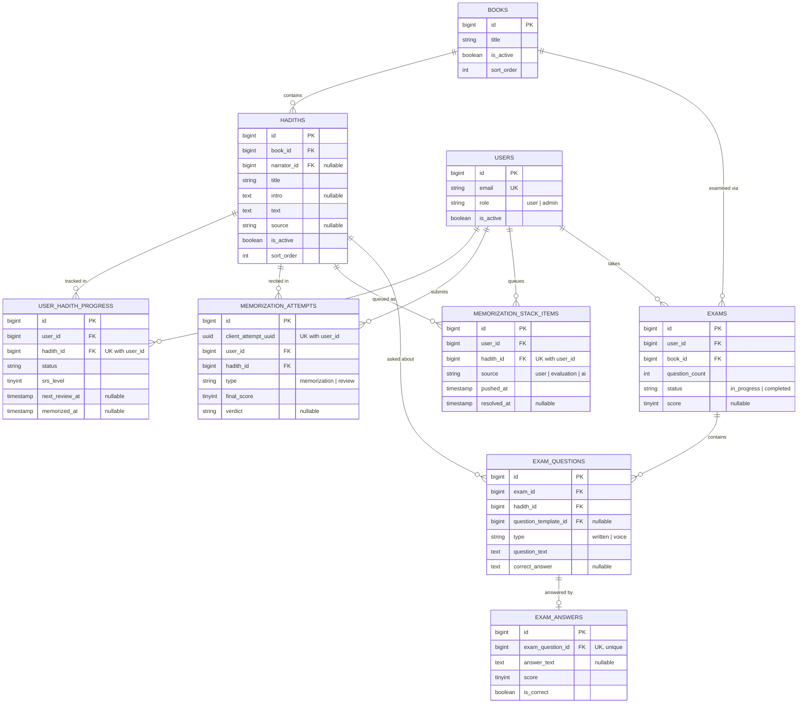
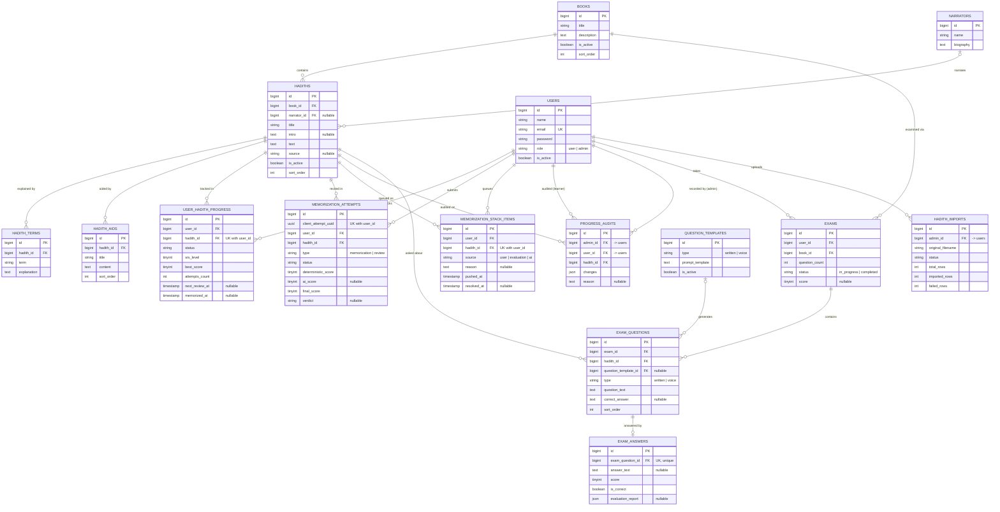

# Athar — ERD

The database has 25 tables, but 10 of them are not domain tables: Laravel's own
`migrations`, `cache`, `cache_locks`, `jobs`, `job_batches`, `failed_jobs`,
`sessions`, `password_reset_tokens`, plus `media` (Spatie, polymorphic) and
`personal_access_tokens` (Sanctum). The remaining 15 are below.

## Core

The nine tables the memorization and exam flows actually run on.

## Full

Adds content enrichment (`narrators`, `hadith_terms`, `hadith_aids`), the exam
question bank (`question_templates`), and the two admin logs
(`progress_audits`, `hadith_imports`).

Not shown: `media` (polymorphic, attaches to `books`/`hadiths`), `personal_access_tokens` (polymorphic, attaches to `users`), and Laravel's own `sessions`/`cache`/`jobs`/`password_reset_tokens`.
